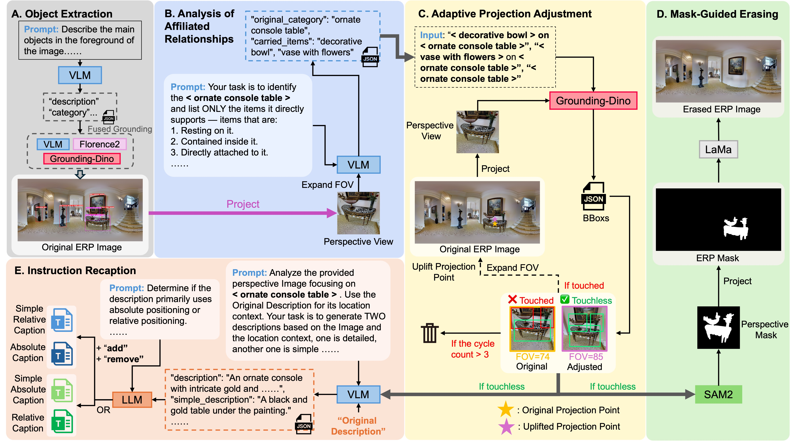
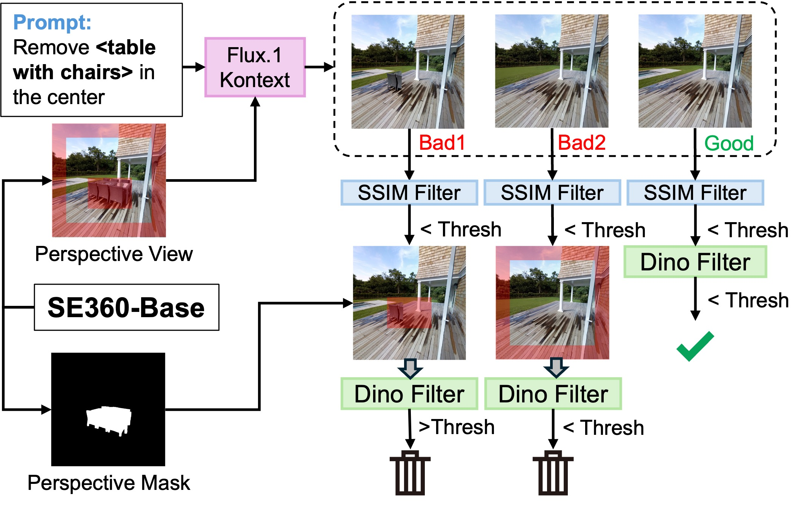
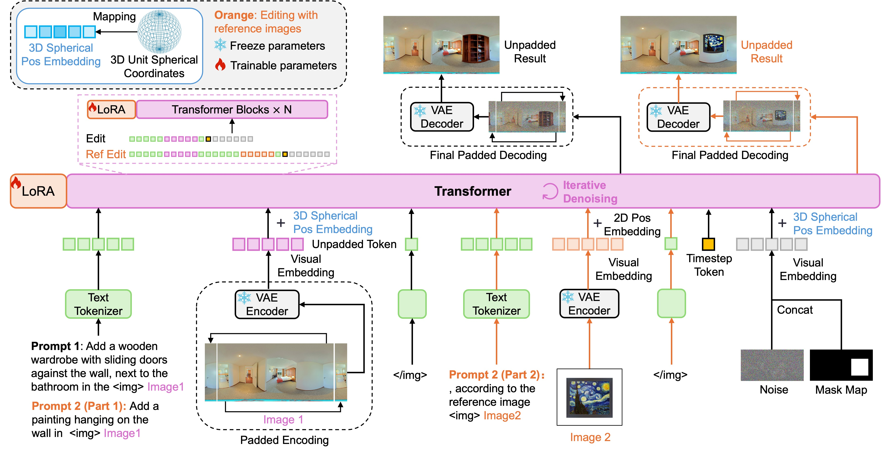

# SE360: Semantic Edit in 360° Panoramas via Hierarchical Data Construction

**This repository contains the official implementation of the paper "SE360: Semantic Edit in 360° Panoramas via Hierarchical Data Construction".**

## 📌 Introduction

SE360 is a novel framework for semantic editing in 360° panoramas. By leveraging hierarchical data construction and advanced generative models, SE360 enables high-quality, semantically consistent edits in panoramic images.

**This paper has been accepted by AAAI 2026.**

**Authors:** Haoyi Zhong, Fang-Lue Zhang, Andrew Chalmers, Taehyun Rhee

## 📋 TODO List

- [x] Data Generation Pipeline
- [x] Panoramic Image Editing
- [ ] Reference Image-based Panoramic Editing (Coming Soon)

## 📸 Visual Showcase

### Data Creation Pipeline



### Model Structure


### Dataset Examples


## 🛠️ Installation

This project has two separate environments:
- **Data Creation**: For dataset preparation and processing
- **Image Editing**: For model training and inference

### 1. Clone the repository
```bash
git clone https://github.com/zhonghaoyi/SE360.git
cd SE360
```

### 2. Install dependencies


#### Option A: Data Creation Environment

This environment is used for dataset preparation and processing pipelines (SE360_Base and SE360_HF).

**Step 1: Install Python dependencies**

```bash
conda create -n se360_data python=3.12
conda activate se360_data

# Install PyTorch based on your CUDA version
# For CUDA 12.1 (pytorch 2.5.1):
pip install torch torchvision --index-url https://download.pytorch.org/whl/cu121

# For CUDA 12.6:
# pip install torch torchvision --index-url https://download.pytorch.org/whl/cu126

pip install -r requirements_datacreation.txt
```

**Step 2: Download checkpoint weights**

Download the required model weights and place them in the `checkpoints/` directory.

```bash
# Download your model weights here
https://drive.google.com/drive/folders/1Hpdf9hEF9HyCnY-BtcjsOypIOq6caZ-L?usp=drive_link

```

**Step 3: Install Grounded-SAM**

```bash
export AM_I_DOCKER=False
export BUILD_WITH_CUDA=True
export CUDA_HOME=/path/to/cuda-12/  # Modify this to your CUDA installation path

python -m pip install -e segment_anything
pip install --no-build-isolation -e GroundingDINO
```

**Step 4: Install SAM2**

```bash
cd SE360_Base/Grounded_SAM_2
pip install -e .
cd ../..  # Return to project root
```

**Step 5: Install Flash Attention 2**

Download the appropriate wheel file based on your Python, PyTorch, and CUDA versions from the [Flash Attention releases page](https://github.com/Dao-AILab/flash-attention/releases/tag/v2.7.4.post1).

For example, on Linux with PyTorch 2.5, Python 3.12, and CUDA 12.1:

```bash
# Install the wheel
pip install flash_attn-2.7.4.post1+cu12torch2.5cxx11abiFALSE-cp312-cp312-linux_x86_64.whl
```

> **Note:** Make sure to select the correct wheel file that matches your specific Python version (cp3XX), PyTorch version, and CUDA version.


#### Option B: Image Editing Environment 

This environment is used for training and inference with the SE360 model.

```bash
conda create -n se360 python=3.9
conda activate se360

# Install PyTorch based on your CUDA version
# For CUDA 12.1 (pytorch 2.5.1):
pip install torch torchvision --index-url https://download.pytorch.org/whl/cu121

# For CUDA 12.6:
# pip install torch torchvision --index-url https://download.pytorch.org/whl/cu126


pip install -r requirements.txt
```


> **Note:** Choose the environment based on your task. 


## 📂 Data Preparation

The project expects the dataset to be organized in the `data/` directory. The default configuration looks for Matterport3D data.

### Download Matterport3D

For downloading Matterport3D data, please refer to the download instructions from [PanFusion](https://github.com/chengzhag/PanFusion.git).

### Expected structure (Only show Matterport3D)
```
data/
├── Matterport3D/
│   ├── mp3d_skybox/           # Original skybox images
│   ├── SE360_HF/              
│   ├── SE360_Base/            
│   └── test_final_without_artifacts/  # Test dataset
```

### Download Test Dataset

Download the test dataset from [testset](https://drive.google.com/file/d/1rBdDS1A8UCWGV0eKWhcOZ0RlM1J6DmfZ/view?usp=drive_link) and extract it to `data/Matterport3D/`:

```bash
# Navigate to the Matterport3D directory
cd data/Matterport3D

# Extract the downloaded test dataset
# The directory structure should be: data/Matterport3D/test_final_without_artifacts
```


## 🚀 Usage

### Part 1: Data Creation Pipeline

This section covers the creation of SE360_Base and SE360_HF datasets. Run the scripts in the numbered order as indicated by their filenames.

#### SE360_Base Dataset Creation

Navigate to the `SE360_Base/` directory and run the scripts in order:

```bash
cd SE360_Base

# Step 1: Generate 360° descriptions
python generate_all_360descriptions_1.py

# Step 2: Clean forbidden data
python clean_forbiden_2.py

# Step 3: Additional processing steps
python grounding_dino_all_coarse_bbox_3.py
python Qwenvl_obj_pers_bbox_coarse_crop_3.py
python florence2_all_crop_3.py

# Step 4: Match models
python 3model_all_match_4.py

# Continue with remaining steps...
# (Follow the numbering in the filenames)
```

#### SE360_HF Dataset Creation

Navigate to the `SE360_HF/` directory and run the scripts in order:

```bash
cd SE360_HF

# Step 1: Find items
python find_item_1.py

# Step 2: ERP to perspective
python ERP2pers_2.py

# Step 3: Flux batch processing
python flux_batch_3.py

# Continue with remaining steps...
# (Follow the numbering in the filenames)
```

### Part 2: Image Editing Model

This project uses `LightningCLI` for configuration and execution. You can run training and evaluation using `main.py`.

#### Configuration

For advanced users who want to customize the model:

- **Dataset Parameters**: Modify dataset settings in [`dataset/PanoDataset.py`](dataset/PanoDataset.py)
- **Model Strategy**: Configure model training strategies in [`models/SE360/PanoGenerator.py`](models/SE360/PanoGenerator.py)

#### Training


1. To start training the SE360 model in Base Phase:

```bash
python main.py fit \
    --model=SE360 \
    --data=SE360_Base \
```
2. To start training the SE360 model in HF Phase:

```bash
python main.py fit \
    --model=SE360 \
    --data=SE360_HF \
    --ckpt=SE360_Base.ckpt \
```

#### Inference / Testing

**Configuration Parameters:**

- **`test_function`**: Controls the testing functionality. Set this parameter in `dataset/PanoDataset.py` (line 647) to specify the test operation (e.g., `'add'` for object addition, `'remove'` for object removal).
- **`use_ref`**: Enable reference image-based editing. Set to `True` in `dataset/PanoDataset.py` (line 649) to use reference images during training or inference.

1. To run inference using a trained checkpoint:

```bash
python main.py test \
    --model=SE360 \
    --data=SE360_Base \
    --ckpt=checkpoints/se360_step_step=001000.ckpt \
```

*   `--ckpt`: Path to the model checkpoint.

2. To evaluate the results:

```bash
python main.py test \
    --model=EvalPanoGen \
    --data=SE360_Base \
    --result_dir=logs/your_result_dir/test

```

*   `--result_dir`: Directory where results will be saved.


## 🙏 Acknowledgement


This project builds upon and integrates several excellent open-source projects:

- [PanFusion](https://github.com/chengzhag/PanFusion.git) 
- [MVDiffusion](https://github.com/Tangshitao/MVDiffusion.git) 
- [SAM2](https://github.com/facebookresearch/sam2.git) 
- [Grounded-Segment-Anything](https://github.com/IDEA-Research/Grounded-Segment-Anything.git) 
- [LaMa](https://github.com/advimman/lama.git) 
- [OmniGen](https://github.com/VectorSpaceLab/OmniGen.git) 

We thank the authors for their valuable contributions to the community.


